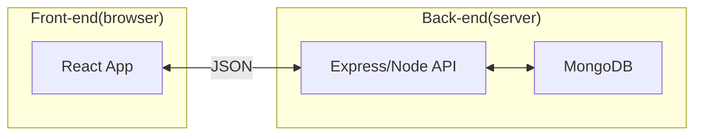

# MERN Stack

- **M**ongo db
- **E**xpress
- **R**eact
- **N**ode.js

When we need to interact with the back-end (such as send an authentication request) we send it to the back-end  

We typically interact with a database (like MongoDB) to authenticate, sign-in, sign off etc.

This separation is required to not expose any sensititve information in the front-end (ie. React)

**Goal:** Workout Buddy Website 

