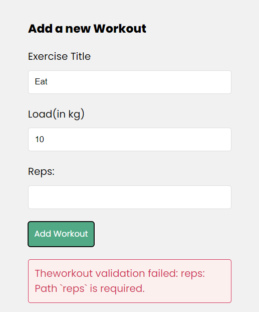
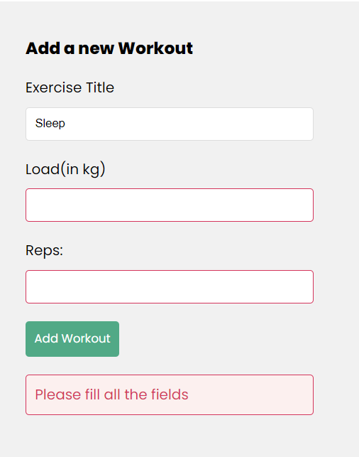

# Handling Error Responses

Currently when we try to add a new workout but the fields are missing, the error message is a bit cryptic to someone who doesn't know how this website works:



(not too much though)


Also we can highlight the border red for the fields the user is missing, cause, fun

## Now we step back into the backend 

Currently when we try to add an object and it doesn't work, we catch the error we receive and pass it on as a json object:

```js
// CREATE a new workout
const createWorkout = async (req,res)=>{
    const {title,load,reps} = req.body;

    // add workout to db
    try{
        const workout = await Workout.create({title, load, reps});
        res.status(200).json(workout);
    }
    catch(err){
        res.status(400).json({error: err.message});
        // console.log(err);
    }

    // res.json({msg: 'POST a new workout'});
}
```
Mongoose throws that error when we try to add something that doesn't match our database schema, which is this:

```js
const mongoose = require('mongoose');

const Schema = mongoose.Schema;

const workoutSchema = new Schema({
    title: {
        type: String,
        required: true
    },
    reps: {
        type: Number,
        required: true
    },
    load: {
        type: Number,
        required:true
    }
}, { timestamps: true });

const Workout = mongoose.model('Theworkout', workoutSchema);

module.exports = Workout
```

So let's do another manual check in the `createWorkout` method:

```js
const createWorkout = async (req,res)=>{
    const {title,load,reps} = req.body;

    let emptyFields = [] //init to array - it stores the fields which are empty
    
    if (!title){emptyFields.push('title')}
    if (!load){emptyFields.push('load')}
    if (!reps){emptyFields.push('reps')}

    if (emptyFields.length > 0){
        return res.status(400).json({ error: 'Please fill all the fields', emptyFields})
    }

    // database logic
}
```
Now notice the response contains the empty array which stores the fields which are empty- this can be used in the frontend as needed

Now we will go to the **WorkoutForm.js** component

In the function where we handle the form submission, this is where the error is set:
```js
const handleSubmit = async (event)=>{
    
    // finding the response 

    const json = await response.json();

    if (!response.ok){
        setError(json.error); // this is where the error is set
    }
    else{
        // do the normal stuff
    }
}
```

Now at least the error *message* is fine. But the json response also contains the fields which are empty. So let's create a state for this

```js
const WorkoutForm = () =>{
    const { dispatch } = useWorkoutContext();

    // other states
    const [emptyFields, setEmptyFields] = useState([]);

    const handleSubmit = async (event)=>{
        //finding response
        const json = await response.json();

        if (!response.ok){
            setError(json.error);
            setEmptyFields(json.emptyFields); //set this too
        }
        else{
            setError(null);
            // If it was ok-reset everything to empty string
            setTitle('');
            setLoad('');
            setReps('');
            // Reset empty fields:
            setEmptyFields([]);
            dispatch({type: 'CREATE_WORKOUT', payload: json})
        }
    }

    return (
        //HTML template
    )
}
```

Now we need to modify the HTML template a bit.
```js
return(
    <form className="create" onSubmit={handleSubmit}>
        <h3>Add a new Workout</h3>
        <label>Exercise Title</label>
        <input 
            type="text"
            onChange={(event) => setTitle(event.target.value)} 
            value = {title} //update the content inside the form as the user updates it!
            className={emptyFields.includes('title') ? 'error': ''}
        />
)
```
(similarly for load & reps)

Then we need to add some new css in **index.css**:
```css
/*This was there before*/
:root {
  --primary: #1aac83;
  --error: #e7195a;
}

/*This is new */
input.error{
  border: 1px solid var(--error);
}
```

Now you see the red box around the input box if you miss a field:


ezez