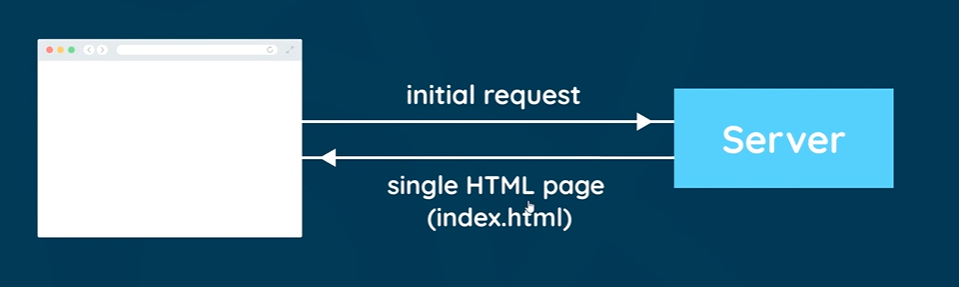
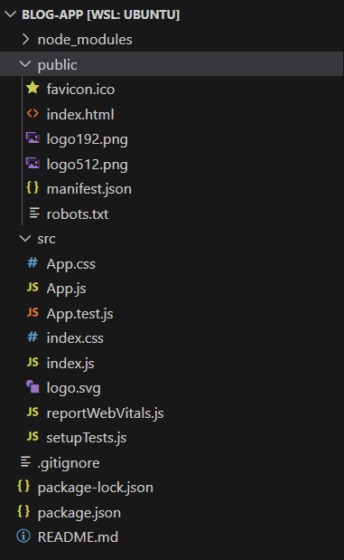

# React Introduction

## What is React?

- JS library to create websites
- Allows to create **Single Page Apps**(SPA's)

Single page means we only need to send a single HTML page to the server. React then manages the single page alone on the browser.


If need to change HTML pages, we do not need to use the server! React can open page from URL alone. Usually the server handles different pages for different URL's - the server makes the new HTML page to render.

**Aim:** Blog website


Use **React Snippet tools in vscode** to generate boilerplate code.

# Creating a React Application

Using `create-react-app` to make it:

```bash
npx create-react-app blog-app
```
This sets up a lot of things for you.


## Structure of the project:


(delete all the test files and setupTest files - remove the right imports too)
- **node_modules**: Stores the project dependencies (and any packages you install)
- **public**: All files public to the browser (like `index.html`) that it to be sent to the browser. The `index.html` file is the only file that is sent to the browser.
- **src**: Most of the code you actively interact with will be in this folder. `App.js` is a component - like the other components.

The `index.html` has the following:
```html
<body>
     <!--  ...  -->
    <div id="root"></div>
    <!--  ...  -->
  </body>
```

The `root` id comes from `src/index.js`:

```js
//...
const root = ReactDOM.createRoot(document.getElementById('root'));
root.render(
  <React.StrictMode>
    <App />
  </React.StrictMode>
);
//...
```

This renders `<App />` to the DOM. The `App` component comes from `src/App.js`

`<React.StrictMode>` gives warnings on the console for any problems.

- **package.json**: Lists all the dependencies of the application
  ```json
  {
  "name": "blog-app",
  "version": "0.1.0",
  "private": true,
  "dependencies": {
    "@testing-library/jest-dom": "^5.17.0",
    "@testing-library/react": "^13.4.0",
    "@testing-library/user-event": "^13.5.0",
    "react": "^18.2.0",
    "react-dom": "^18.2.0",
    "react-scripts": "5.0.1",
    "web-vitals": "^2.1.4"
  },
  //...
  }
  ```
  All of these are in `node_modules`. It also has some scripts
  ```json
  "scripts": {
    "start": "react-scripts start",
    "build": "react-scripts build",
    "test": "react-scripts test",
    "eject": "react-scripts eject"
  },
  ```
  `start` is used to **test application on localhost** and `build` is used to **build application for deployment**.


Also if `node_modules` isn't there, to get it run `npm install`. This will install all the dependencies scripts from `package.json`.


