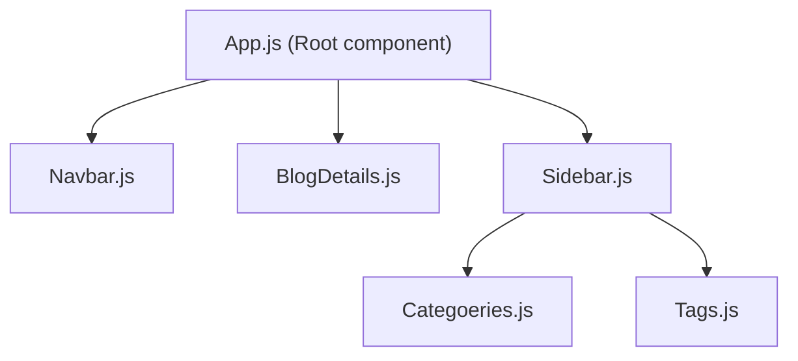

# Components & Templates

A react app is made of components, which are self contained sections of content. Like navbars, articles, sidebars, etc.

Components contain:
- **Template**: The HTML for the component
- **Logic**: The javascript to render correctly. Eg: code for logging out upon button press.


Remove the initial code in `App.js`:
```js
import './App.css';

function App() {
  return (
    <div className="App">
      
    </div>
  );
}

export default App;
```

You can add normal HTML code in the return


## Export

Doing `export default App;` is done so that we can use it in other files.

You can import it (for example in `index.js`) like this:

```js
import App from './App';
```

# Dynamic Values in Templates

Variables in the returned HTML are done with curly braces

```js
import './App.css';

function App() {
  const title = "Blog app";
  const likes = 50;

  return (
    <div className="App">
      <div className="content">
        <h1>{ title }</h1>
        <p>Liked { likes } times</p>
      </div>
    </div>
  );
}

export default App;
```

It converts everything to string by default.

You cannot easily output an object like this:
```js
const person = { name: 'yoshi', hobby:'eggs'};
```

The things inside curly braces could also just be normal JS

```js
<p> { Math.random()* 10 } </p>
```

# Multiple Components

`App` is the highest level component - react directly renders that in `index.js`

It makes a component tree:

All these components are nested inside `App.js`

Let's make `Navbar.js`

```js
const Navbar = () => {
    return ( 
        <nav className="navbar">
            <h1>The Voyage Blogs</h1>
            <div className="links">
                <a href="/">Home</a>
                <a href="/create">New Blog</a>
            </div>
        </nav>
     );
}
 
export default Navbar;
```

Importing navbar into root component:
```js
import './App.css';
import Navbar from './Navbar'

function App() {
  return (
    <div className="App">
      <Navbar />

      <div className="content">
        <h1>App component</h1>
      </div>
    </div>
  );
}

export default App;
```

The navbar has a link for the home page, so let's make that in `Home.js`. 

# Styling the templates

Let's add some CSS! It gets it from `App.css` as it says at the top of `App.js`:
```js
import './App.css';
//...
```

We don't need it, for smaller projects its easier to manage with `index.css`. Deleting `App.css` and removing its imports.

Some CSS later it looks half decent:


## in-line styling
Now we can use dynamic styles!

So you can do this in **Navbar.js**:
```js
const Navbar = () => {
    return ( 
        <nav className="navbar">
            <h1>My Voyage Blogs</h1>
            <div className="links">
                <a href="/">Home</a>
                <a href="/create" style={{
                    color: 'white',
                    backgroundColor: '#f1356d', // NOT background-color
                    borderRadius: '8px'
                }}>New Blog</a>
            </div>
        </nav>
     );
}
 
export default Navbar;
```

