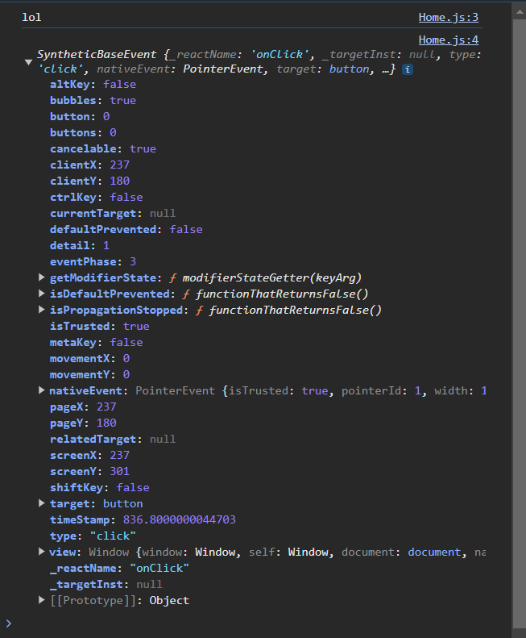

# Click Events & Functions

A simple example of a onClick event:

```js
const Home = () => {
    const handleClick = ()=>{
        console.log("lol");
    }

    return ( 
        <div className="home">
            <h2>Homepage</h2>
            <button onClick={handleClick}>Click me</button>
        </div>
     );
}
 
export default Home;
```

## Arguments to functions

One problem is we can't do 
```js
<button onClick={handleClick()}>Click me</button>
```
since it will invoke the function without even having the onClick. This is a problem, so we can't do something like `handleClick("yoshi")` to give it args. 

The workaround is to wrap it inside an anonymous function:
```js
const handleClickAgain = (name)=>{
        console.log("hello, "+ name);
    }

return(
    <button onClick={()=>{
        handleClickAgain("Mario")
    }}>The arguments letsgoo</button>
)
```


## Event object/parameter

If you have no parameters, it will automatically give the first parameter the event object.

Let's modify tbhe first `handleClick` function:

```js
const handleClick = (e)=>{
    console.log("lol");
    console.log(e);
}
```
and in the console we see the following:



This is just information about the event we can use directly (for example, positions and stuff)

### What if there are already arguments?
Remember the function you wrapped it around? That has event parameter:

```js
const handleClickAgain = (name,e)=>{
        console.log("hello, "+ name, e);
    }

<button onClick={(e)=>{handleClickAgain("Mario",e)}}>The arguments letsgoo</button>
```

Now the event object will get logged too!

