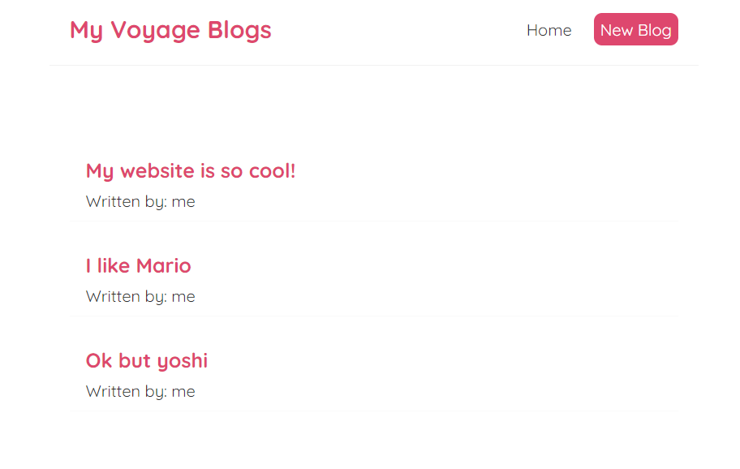

# Outputting Lists

Say you want to render this list (created with a state hook):

```js
const [blogs, setBlogs] = useState([
        { title: 'My website is so cool!', body: 'see it!', author: 'me', id:1},
        { title: 'I like Mario', body: 'luigi is nice too', author: 'me', id:2},
        { title: 'Ok but yoshi', body: 'and his eggs', author: 'me', id:3}
    ])
```


Theoretically to render this you can make a div for each item, but that doesn't scale well (if at all)

So we cycle through this array using `map` and return a template for each item.

```js
    return ( 
        <div className="home">
            {blogs.map((blog)=>(
                <div className="blog-preview" key={blog.id}>
                    <h2>{blog.title}</h2>
                    <p>Written by: {blog.author}</p>
                </div> 
            ))}
        </div>
     );
```

> NOTE: Put the `key` in the div class, that is how the react DOM keeps track of each block and assigns it a unique identity. It will give errors if you don't give this!

*some CSS later* it looks nice



