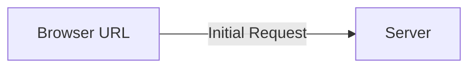
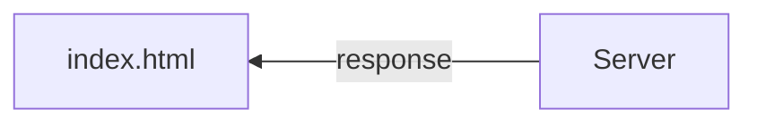
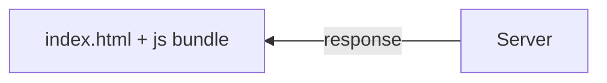

# The React Router

## For non-react websites...

When a browser receives a URL, it sends a request to the server with the URL



and the server responds with a HTML page to render


and this cycle repeats itself for any URL request the browser receives.


## React Website (SPA's - Single Page Applications)

When react sends a request to the server, it works around the same way


and the server responds with a HTML page to render **along with a JS bundle** which control our react application



Then react injects the content dynamically into the browser. It is then entirely responsible for updating the DOM.

So that is why we assign top-level components for each URL

|/ | /contact | /about |
|-|-|-|
|Home.js|Contact.js|About.js

## Setting up

We need to install react router library

```bash
npm install react-router-dom
```
and it should also update `package.json` and `node_modules`

First thing to do is import this into **App.js** and wrap the website in a router:

```js
import Navbar from './Navbar.js';
import Home from './Home';

import { BrowserRouter as Router, Route, Routes} from 'react-router-dom';

function App() {
  return (
    <Router>
      <div className="App">
        <Navbar />
        <div className="content">
          <Home />
        </div>
      </div>
    </Router>
  );
}

export default App;
```


Now we are rendering `<Home />` in the `content` div class, so let's replace it with the routes

```js
function App() {
  return (
    <Router>
      <div className="App">
        <Navbar />
        <div className="content">
          <Routes>
            <Route path="/" element={<Home />}>
            </Route>
          </Routes>
        </div>
      </div>
    </Router>
  );
}
```

You can add more routes like this

# Exact Math Routes

Let's make a new page, which is a webform that can add new blogs


**src/Create.js**:
```js
const Create = () => {
    return ( 
        <div className="create">
            <h2>Add a New Blog</h2>
        </div>
     );
}
 
export default Create;
```

For now we can just try routing to this.

**App.js**:
```js
//imports...

function App() {
  return (
    <Router>
      <div className="App">
        <Navbar />
        <div className="content">
          <Routes>
            <Route exact path="/" element={<Home />} /> 
            <Route exact path="/create" element={<Create />} />
          </Routes>
        </div>
      </div>
    </Router>
  );
}

```

> The `exact` keyword is needed in `react-router-dom` version 5 at least, since it otherwise greps for the path pattern and matches if it is there as a substring and not the whole string!

A small problem is that each time we re-route, we are still sending a request to the server! That is slow. We will have to use special react router links

# Router Links

Currently this is the Navbar:
```js
const Navbar = () => {
    return ( 
        <nav className="navbar">
            <h1>My Voyage Blogs</h1>
            <div className="links">
                <a href="/">Home</a>
                <a href="/create">New Blog</a>
            </div>
        </nav>
     );
}
 
export default Navbar;
```


Replace  `<a href="">` with `<Link to="">`  and you have links!

```js
import { Link } from 'react-router-dom';


const Navbar = () => {
    return ( 
        <nav className="navbar">
            <h1>My Voyage Blogs</h1>
            <div className="links">
                <Link to="/">Home</Link>
                <Link to="/create">New Blog</Link>
            </div>
        </nav>
     );
}
 
export default Navbar;
```

You will still see `<a>` tags in the inspect element code area.

This is significantly faster than sending requests to the server over and over, since it already has everything it needs to render the site.

> **One small problem:** When you go the New Blogs page, the hook you created is still running and changing the state in the Home page in the background, causing an error. This leads to memory leaks! It is attempting to update the state of the Home component even when the Home component has been unmounted from the DOM

# useEffect cleanup

We need a way for the `useFetch` hook to not run the `useEffect` hook when it is not needed, ie. **Home.js** is not being rendered.

The cleanup function in `useEffect` is just a function that it returns.\
Let's try to see when it runs:
```js
const useFetch = (url)=>{
    // states

    useEffect(()=>{ 
        //fetch logic

        return ()=> console.log('cleanup');
        }, [url]); 

    return {data, isPending, error};
}
```

This gets logged every time you switch from `/` to `/create`! It runs every time the component that uses it is unmounted from the DOM

## Abort controller
To write this we will use an abort controller

You can assign a signal from the `abortController` to the useEffect hook's fetch function so that it controls that and stops when needed.

```js
useEffect(()=>{ 
    const abortCont = new AbortController();

    fetch(url, { signal: abortCont.signal }) //general URL
        .then(res => {
            if (!res.ok){
                throw Error('Could not fetch data for that resource');
            }
            return res.json();
        })
        .then(data=>{
            setData(data);
            setIsPending(false);
            setError(null);
        })
        .catch(err =>{
            setError(err.message);
            setIsPending(false);
        })

    return () => abortCont.abort;
    }, [url]);
```

Why is there a problem? Even though we have aborted it, when we `catch` an error, we just update the `pending` and `error` states!! So it is still doing that same thing.

So we want to catch abort errors separately

```js
.catch(err =>{
    if (err.name === 'AbortError'){
        console.log('Fetch aborted');
    }
    else{
        setError(err.message);
        setIsPending(false);
    }
})
```

# Route Parameters

Sometimes we may want to pass dynamic values to paths, like `/blogs/123` to fetch blog with id `123`

Let's create `src/BlogDetails.js`:
```js
const BlogDetails = () => {
    return ( 
        <div className="blog-details">
            <h2>BLog Details</h2>
        </div>
     );
}
 
export default BlogDetails;
```

and in **App.js**:
```js
function App() {
  return (
    <Router>
      <div className="App">
        <Navbar />
        <div className="content">
          <Routes>
            <Route exact path="/" element={<Home />} /> 
            <Route exact path="/create" element={<Create />} />
            <Route exact path="/blogs/:id" element={<BlogDetails />} />
          </Routes>
        </div>
      </div>
    </Router>
  );
}
```

Currently the `id` doesn't matter, it renders it for any ID

Now to fetch the id, we will use a `useParams` hook:

**BlogDetails.js**:
```js
import { useParams } from "react-router-dom";

const BlogDetails = () => {

    const { id } = useParams(); // get id from the URL

    return ( 
        <div className="blog-details">
            <h2>BLog Details - {id}</h2>
        </div>
     );
}
 
export default BlogDetails;
```

So now the `id` gets displayed on the title


On the Homepage, first let's add links so that it goes to the right blog \
**BlogList.js**:
```js
const BlogList = ({blogs,title}) => {

    return ( 
        <div className="blog-list">
            <h2>{title}</h2>
            {blogs.map((blog)=>(
                <div className="blog-preview" key={blog.id}>
                    <Link to={`/blogs/${blog.id}`}>
                        <h2>{blog.title}</h2>
                        <p>Written by: {blog.author}</p>
                    </Link>
                </div> 
            ))}
        </div>
     );
}
```

now we have a `Link` to the right `blog.id` :D\

If you're picky like me you can remove the underline in the `a` tags:
```css
.blog-preview a{
  text-decoration: none;
}
```

# Re-using our custom hook

To show the data on the `blogs/id` page, we will need to fetch data, and we can use our custom `useFetch` hook for that to fetch the data.

Remember, the `useFetch` hook returns the following:
```js
return {data, isPending, error};
```

so the data we get back, whether the data is pending, and what (if any) error we have.


Now if you update `BlogDetails.js`:
```js
import { useParams } from "react-router-dom";
import useFetch  from './useFetch';

const BlogDetails = () => {

    const { id } = useParams(); // get id from the URL
    const { data: blog, error, isPending } = useFetch('http://localhost:8000/blogs/' + id); 

    return ( 
        <div className="blog-details">
            { isPending && <div>Loading...</div> }
            { error && <div>{error}</div> }
            { blog && (
                <article>
                    <h2>{ blog.title }</h2>
                    <p>Written by: { blog.author }</p>
                    <div>{blog.body}</div>
                </article>
            )}
        </div>
     );
}
 
export default BlogDetails;
```

