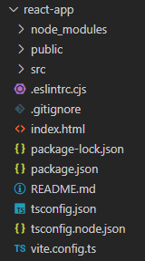
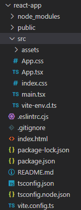
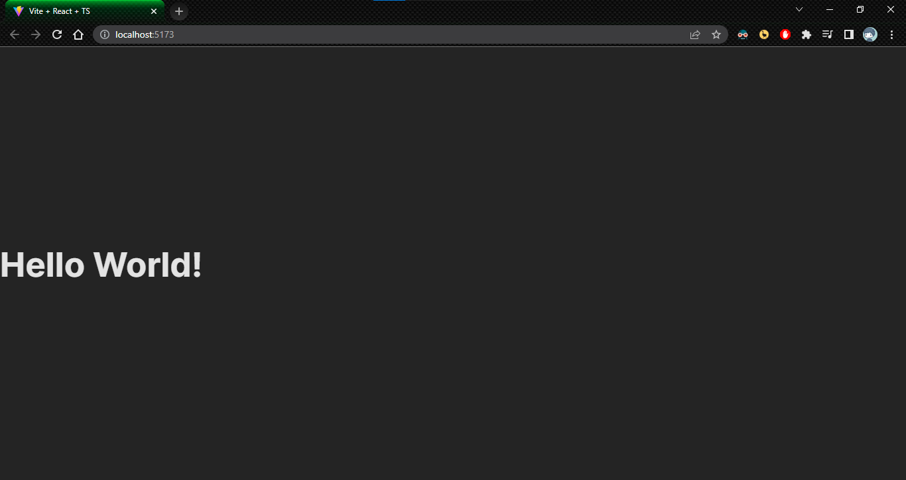
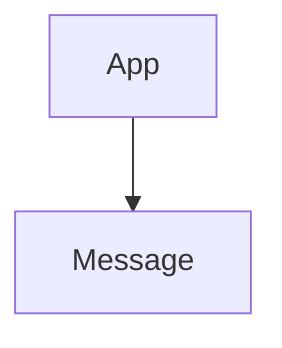
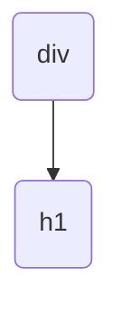
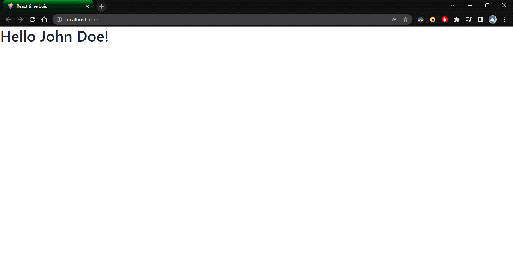
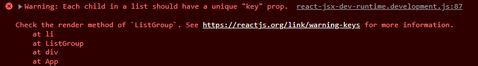
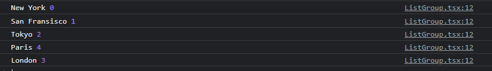
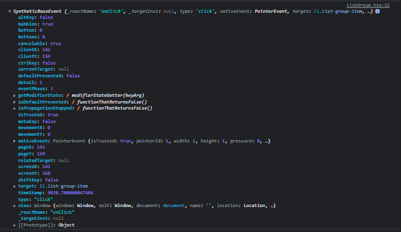
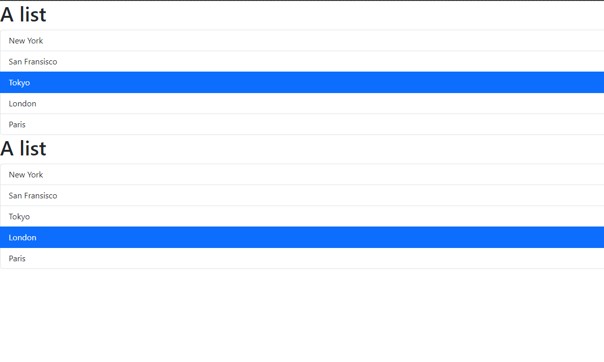

# React intro

## Creating the react app

First create the `vite` ap  p:

```bash
npm create vite@latest
```

It will prompt a project name(just enter `react-app` if you can't think of anything else)<br>
Then choose a framework(react duh)<br>
Choose typescript after that(yes, *not js*) 
`cd` into the folder

Run the following then:

```bash
npm install
npm run dev
```

You should get the localhost and see the site so far

## Structure

<center></center>

- `node_modules`: 3rd party libraries (like react n stuff) are installed. **dont need to touch this**
- `public`: public assets of website(images/images/videos)
- `src`: source code of application. It has `App.tsx` as the main thingy. It is the only component so far

<center></center>

- `index.html` is a vanilla HTML page:

  ```html
  <!doctype html>
  <html lang="en">
    <head>
      <meta charset="UTF-8" />
      <link rel="icon" type="images/image/svg+xml" href="/vite.svg" />
      <meta name="viewport" content="width=device-width, initial-scale=1.0" />
      <title>Vite + React + TS</title>
    </head>
    <body>
      <div id="root"></div>
      <script type="module" src="/src/main.tsx"></script>
    </body>
  </html>
  ```
  
  `<div id="root">` is the main container of the application.
  `src/main.tsx` is the entry point to application
  
- `package.json`: contains info about project(name, version, scripts, dependencies etc)<br>
   Current dependencies: `React` and `ReactDOM` 

  ```json
  "dependencies": {
      "react": "^18.2.0",
      "react-dom": "^18.2.0"
    },
  ```

  Developer dependencies: (used for development)

  ```json
  "dependencies": {
      "react": "^18.2.0",
      "react-dom": "^18.2.0"
    },
  ```

- `tsconfig.json` : setting how to tell typescript to compile to javascript

## Creating React components

Create `Message.tsx` inside  `src` 

**Message.tsx**: 

```jsx
function Message(){
    //JSX: JavaScript XML
    return <h1>Hello World!</h1>;
}

export default Message;
```

JSX converts XML or HTML code to equivalent JS code. Can return HTML tags this way

Recreating `App.tsx `to have this component

**App.tsx**: 

```jsx
import Message from './Message';

function App(){
  return <div><Message /></div>;
}

export default App;
```

`<Message />` is a self-closing HTML tag. It is equivalent to `<Message> </Message>`

This firstly exports the Message component from `Message.tsx` and uses that to put it inside a div tag in the main app

This is what you get right now:


Let's modify `Message.tsx` to make some cooler(*different*) stuff(not really but it suffices as an example):

```jsx
function Message(){
    //JSX: JavaScript XML
    const name = "John Doe";
    if (name){
    	return <h1>Hello {name}!</h1>;
    }
    return <h1>Hello World!</h1>
}

export default Message;
```

The curly braces can have any JS. It can be functions, or anything else.
Replacing name with empty string gives Hello World like before

## How React works

Current component tree: 



`App` is a top-level component/root

When app starts React takes this component tree and makes a JS data structure called "**Virtual DOM**"



When data of a component changes react updates virtual DOM, finds changes between previous and current and updates only those.
This is done by `react-dom` in `package.json`:

```json
  "dependencies": {
    "react": "^18.2.0",
    "react-dom": "^18.2.0"
  },
```

If you check `main.tsx` to see how it works:

```tsx
import React from 'react'
import ReactDOM from 'react-dom/client'
import App from './App.tsx'
import './index.css'

ReactDOM.createRoot(document.getElementById('root')!).render(
  <React.StrictMode>
    <App />
  </React.StrictMode>,
)
```

It updates an element with id "root". It has `<App />` which is wrapped by `React.StrictMode`

## Setting up components

First installing bootstrap(a very cool CSS library)
Open a terminal in the react app and run:

```bash
> npm install bootstrap
added 2 packages, and audited 206 packages in 6s

42 packages are looking for funding
  run `npm fund` for details

found 0 vulnerabilities
```

See the `src` folder contains 2 css files: `App.css`(styles for `App` component)  and `index.css`(global styles for application)<br>
You can clear `App.css` and delete `index.css`. Then go to `main.tsx` and change:<br>
`import './index.css'` to `import bootstrap/dist/css/bootstrap.css`

Now the style of the website has changed, since we removed most of the CSS



## List Group component

Now to manage components, create a new folder in `src` called components
Add `ListGroup.tsx` in it

**ListGroup.tsx**:

```tsx
function ListGroup(){
    return <h1>List Group</h1>;
}

export default ListGroup;
```

Now we can modify **App.tsx** to have this `ListGroup`:

```tsx
import ListGroup from './components/ListGroup';

function App(){
  return <div><ListGroup /></div>;
}

export default App;
```

Right now the Listgroup is just a `h1` tag. To make it an actual List group,<br>
go to [bootstrap website](https://getbootstrap.com/docs/5.3/getting-started/introduction/) and scroll down to Components and find ListGroup and take the code lmao

**ListGroup.tsx**: 

```tsx
function ListGroup(){
    return(
     <ul className="list-group">
        <li className="list-group-item">An item</li>
        <li className="list-group-item">A second item</li>
        <li className="list-group-item">A third item</li>
        <li className="list-group-item">A fourth item</li>
        <li className="list-group-item">And a fifth one</li>
     </ul>
    );
}

export default ListGroup;
```

Add brackets around the tag since it has multiple lines
Also change `<ul class="` to `<ul className="` since `class` is a reserved keyword

### Fragments

Returning multiple HTML elements is not possible directly<br>
One way to do that is to wrap everything inside a `div` tag and go from there

In **ListGroup.tsx**:

```tsx
function ListGroup(){
    return(
    <div>
     <h1>A list</h1>
     <ul className="list-group">
        <li className="list-group-item">An item</li>
        <li className="list-group-item">A second item</li>
        <li className="list-group-item">A third item</li>
        <li className="list-group-item">A fourth item</li>
        <li className="list-group-item">And a fifth one</li>
     </ul>
    </div>
    );
}

export default ListGroup;
```

A more elegant solution is to use a *fragment*

```tsx
import { Fragment } from "react";

function ListGroup(){
    return(
    <Fragment>
     <h1>A list</h1>
     <ul className="list-group">
        <li className="list-group-item">An item</li>
        <li className="list-group-item">A second item</li>
        <li className="list-group-item">A third item</li>
        <li className="list-group-item">A fourth item</li>
        <li className="list-group-item">And a fifth one</li>
     </ul>
    </Fragment>
    );
}

export default ListGroup;
```

### Dynamic Rendering of Lists

Make an array of items which we want to render

```tsx
const items = ['New York', 'San Fransisco', 'Tokyo', 'London', 'Paris']
```

We **can't** use for loops<br>
We can use a **map** function though<br>
To map every item to a corresponding `li` element we can use this arrow function: (a functional approach)

```tsx
items.map(item => (<li className="list-group-item">{item}</li>))
```

We can put this in the return in the JSX, but we need to put it in curly braces:

```tsx
import { Fragment } from "react";

function ListGroup(){
    const items = ['New York', 'San Fransisco', 'Tokyo', 'London', 'Paris']
    
    return(
    <Fragment>
     <h1>A list</h1>
     <ul className="list-group">
        {items.map((item) => 
            (<li className="list-group-item">{item}</li> 
        ))}
     </ul>
    </Fragment>
    );
}

export default ListGroup;
```

If you check the console, we have a warning saying:


This means each element of the list (as in `li`)  should have a "key" property which uniquely identifies it. React needs it to keep track of items<br>
In this case each item is a unique string so the string itself can be the key.

```tsx
<Fragment>
     <h1>A list</h1>
     <ul className="list-group">
        {items.map((item) => 
            (<li className="list-group-item" key={item}>{item}</li>
        ))}
     </ul>
    </Fragment>
```

Now the warning will no longer persist

### Conditional Rendering

Just add an if statement bro

```tsx
function ListGroup(){
    let items = ['New York', 'San Fransisco', 'Tokyo', 'London', 'Paris']
    items=[]
    
    if (items.length==0)
        return
        <Fragment>
            <h1>A List</h1> 
            <p>No item found</p>
        </Fragment>
        
    return(...rest of the shit...)
```

To  check if this works, change the `items` to a variable using `let` and reassign to an empty thing

#### Ternary operator

We can be cooler and add this with the rest of the shit using a *ternary operator* 

```tsx
function ListGroup(){
    let items = ['New York', 'San Fransisco', 'Tokyo', 'London', 'Paris']
    items=[]

    return(
    <Fragment>
     <h1>A list</h1>
     {items.length==0?<p>No item found</p>:null}
     <ul className="list-group">
        {items.map((item) => 
            (<li className="list-group-item" key={item}>{item}</li>
        ))}
     </ul>
    </Fragment>
    );
}
```

#### Variables/constants

 We can extract logic and store in separate constant/variable

```tsx
function ListGroup(){
    let items = ['New York', 'San Fransisco', 'Tokyo', 'London', 'Paris']
    items=[]

    const message = items.length==0?<p>No item found</p>:null;

    return(
    <Fragment>
     <h1>A list</h1>
     {message}
     <ul className="list-group">
        {items.map((item) => 
            (<li className="list-group-item" key={item}>{item}</li>
        ))}
     </ul>
    </Fragment>
    );
}
```

#### Functions

Or a function(yes, an arrow function)

```tsx
function ListGroup(){
    let items = ['New York', 'San Fransisco', 'Tokyo', 'London', 'Paris']
    items=[]

    const getMessage = () =>{
        return items.length==0?<p>No item found</p>:null;
    }

    return(
    <Fragment>
     <h1>A list</h1>
     {getMessage()}
     <ul className="list-group">
        {items.map((item) => 
            (<li className="list-group-item" key={item}>{item}</li>
        ))}
     </ul>
    </Fragment>
    );
}
```

#### Using && instead of ternary

We can also replace 

```tsx
{items.length==0?<p>No item found</p>:null;}
```

with

```tsx
{items.length==0 && <p>No item found</p>}
```

So this is where the funky JS rules come into play:

```tsx
true && "hi"
> "hi"

false && "hi"
> false
```

So if it's true we'll get the stuff else it'll give nothing
and this is what we return:

```tsx
return(
    <Fragment>
     <h1>A list</h1>
     {items.length==0 && <p>No item found</p>}
     <ul className="list-group">
        {items.map((item) => 
            (<li className="list-group-item" key={item}>{item}</li>
        ))}
     </ul>
    </Fragment>
    );
```


## Handling Events

To allow items in the list to have some reaction to being clicked(perhaps on the console) we add an `onclick` parameter in the `li` and an arrow function to simply write in the console. This will write "clicked" in the console every time an element is clicked

```tsx
import { Fragment } from "react";

function ListGroup(){
    let items = ['New York', 'San Fransisco', 'Tokyo', 'London', 'Paris']

    return(
    <Fragment>
     <h1>A list</h1>
     {items.length==0 && <p>No item found</p>} 
     <ul className="list-group">
        {items.map((item) => 
            (<li className="list-group-item" key={item} onClick={()=>console.log("clicked")}>{item}</li>
        ))}
     </ul>
    </Fragment>
    );
}

export default ListGroup;
```

To log something more useful(like which element was clicked), and index of the item

```tsx
<ul className="list-group">
        {items.map((item) => 
            (<li className="list-group-item" key={item} onClick={()=>console.log(item)}>{item}</li>
        ))}
     </ul>
```

Adding index: (`map` function automatically takes care of index)

```tsx
return(
    <Fragment>
     <h1>A list</h1>
     {items.length==0 && <p>No item found</p>} 
     <ul className="list-group">
        {items.map((item,index) => 
            (<li className="list-group-item" key={item} onClick={()=>console.log(item,index)}>{item}</li>
        ))}
     </ul>
    </Fragment>
    );
```

So we see:


We can represent the browser event with a parameter by doing:

```tsx
 <ul className="list-group">
        {items.map((item, index) => 
            (<li className="list-group-item" key={item} onClick={(event)=>console.log(event)}>{item}</li>
        ))}
     </ul>
```

and in the console we get this upon clicking


This shows many properties like <br>
`clientX` and `clientY` which show the position where we clicked <br>
`type` which shows the type of event("click")<br>
`target` which shows the element clicked(which is `li` in this case)

We can use these properties to write complicated logic<br>
To create a new function, we need the type of the `event` variable, which is `React.MouseEvent` . If you don't specify type in the `handleClick` function we get an error

```tsx
import { Fragment } from "react";
import { MouseEvent } from "react"; //import this 

function ListGroup(){
    let items = ['New York', 'San Fransisco', 'Tokyo', 'London', 'Paris']

    //Event Handler
    const handleClick = (event: MouseEvent)=>console.log(event);

    return(
    <Fragment>
     <h1>A list</h1>
     {items.length==0 && <p>No item found</p>} 
     <ul className="list-group">
        {items.map((item, index) => 
            (<li className="list-group-item" key={item} onClick={handleClick}>{item}</li>
        ))}
     </ul>
    </Fragment>
    );
}

export default ListGroup;
```


## Managing State

To highlight clicked items. We will use the "active" class from bootstrap and you can just edit the `<li>` to :<br>
`<li className="list-group-item active">` <br>
To highlight one at a time, use variable to keep track `itemSelected` (A value of `-1` means nothing is selected and any value `0` or more is the selected index). Use a ternary operator:

```tsx
import { Fragment } from "react";
import { useState } from "react";

function ListGroup(){
    let items = ['New York', 'San Fransisco', 'Tokyo', 'London', 'Paris']
    let selectedIndex = -1; // -1 = no item selected

    return(
    <Fragment>
     <h1>A list</h1>
     {items.length==0 && <p>No item found</p>} 
     <ul className="list-group">
        {items.map((item, index) => 
            (<li 
                className={selectedIndex==index? "list-group-item active" : "list-group-item"} 
                key={item} 
                onClick={()=>{selectedIndex=index;}}>
                    {item}</li>
        ))}
     </ul>
    </Fragment>
    );
}

export default ListGroup;
```

This doesn't work
This is because the variable `selectedIndex` is local to *this* component and React is not aware of it, so it is not updating the virtual DOM<br>
So we need to tell react that this component may change its state over time using `useState`<br>
It is a hook(more specifically, a state hook) that informs react that this component has data which will change over time

Calling `const arr = useState(-1)` is an array with 2 elements, with `-1` being the default value of the first element<br>
where `arr[0]` is the variable(selectedIndex) in this case and `arr[1]` is the updater function. The updater function updates the variable and informs react, so it knows that the state of the component has changed so the DOM is updated. 

In general, to call useState do:
`const [var, updatevar] = useState(default_value) `and call `updatevar(new_val)` to update value of `var`

```tsx
import { Fragment } from "react";
import { useState } from "react";

function ListGroup(){
    let items = ['New York', 'San Fransisco', 'Tokyo', 'London', 'Paris']

    // Hook
    const [selectedIndex, setSelectedIndex] = useState(-1);

    return(
    <Fragment>
     <h1>A list</h1>
     {items.length==0 && <p>No item found</p>} 
     <ul className="list-group">
        {items.map((item, index) => 
            (<li 
                className={selectedIndex==index? "list-group-item active" : "list-group-item"} 
                key={item} 
                onClick={() => {
                     setSelectedIndex(index);
                 }}>
                    {item}</li>
        ))}
     </ul>
    </Fragment>
    );
}

export default ListGroup;
```

Now it works

One more thing is that each component has it's own state. If we go back to `App.tsx` and do:

```tsx
import ListGroup from './components/ListGroup';

function App(){
  return <div><ListGroup /><ListGroup /></div>;
}

export default App;
```

and we get:



## Passing Data via Props

Making components reusable requires props(or properties) <br>
For example to make a separate listGroup component for a different array which works the same way, we can use props

We will use interface(a typescript feature) to define shape/interface of an object

We can do: (in `ListGroup.tsx`):

```tsx
import { Fragment } from "react";
import { useState } from "react";

interface Props{
    items: string[]; //array of strings
    heading: string; //string
}

function ListGroup(props: Props){
    //the code
}

export default ListGroup;
```

We can expand props to maintain variable names:

```tsx
import { Fragment } from "react";
import { useState } from "react";

interface Props{
    items: string[]; //array of strings
    heading: string; //string
}

function ListGroup({items,heading}: Props){
    const [selectedIndex, setSelectedIndex] = useState(-1);

    return(
    <Fragment>
     <h1>{heading}</h1>
     {items.length==0 && <p>No item found</p>} 
     <ul className="list-group">
        {items.map((item, index) => 
            (<li 
                className={selectedIndex==index? "list-group-item active" : "list-group-item"} 
                key={item} 
                onClick={() => {setSelectedIndex(index);}}>
                    {item}</li>
        ))}
     </ul>
    </Fragment>
    );
}

export default ListGroup;
```

And edit `App.tsx` to:

```tsx
import ListGroup from './components/ListGroup';

function App(){
  let items = ['New York', 'San Fransisco', 'Tokyo', 'London', 'Paris']
  return <div><ListGroup items={items} heading={"Cities"}/> </div>;
}

export default App;
```

And this gives the same output


## Passing Functions via Props

We want a way to notify the parent component (`App.tsx`) in this case about a selected item, to allow it to interact with other components or whatever else<br>
We will modify the "interface" part of the `ListGroup.tsx` part

```tsx
interface Props{
    items: string[]; //array of strings
    heading: string; //string
    // (item: string) => void
    onSelectItem: (item: string)=> void;
}
```

Now we need to use this in `App.tsx` and we by adding a `onSelectItem` in the parameters of the `<ListGroup>` tag. 
We can do it by:

```tsx
import ListGroup from './components/ListGroup';

function App(){
  let items = ['New York', 'San Fransisco', 'Tokyo', 'London', 'Paris']
  const handleSelectItem = (item: string) => {console.log(item);}
  return <div><ListGroup items={items} heading={"Cities"} /> </div>;
}

export default App;
```

finally modify `ListGroup.tsx` to make this function be called onclick:

```tsx
import { Fragment } from "react";
import { useState } from "react";

interface Props{
    items: string[]; //array of strings
    heading: string; //string
    onSelectItem: (item: string) => void;
}

function ListGroup({items,heading,onSelectItem}: Props){
    const [selectedIndex, setSelectedIndex] = useState(-1);

    return(
    <Fragment>
     <h1>{heading}</h1>
     {items.length==0 && <p>No item found</p>} 
     <ul className="list-group">
        {items.map((item, index) => 
            (<li 
                className={selectedIndex==index? "list-group-item active" : "list-group-item"} 
                key={item} 
                onClick={() => {
                    setSelectedIndex(index);
                    onSelectItem(item);
                }}>
                    {item}</li>
        ))}
     </ul>
    </Fragment>
    );
}

export default ListGroup;
```

Now the selected city comes in the console


## States vs Props

| Props                       | State                       |
| --------------------------- | --------------------------- |
| Input passed to a component | Data managed by a component |
| Similar to function args    | Similar to local variables  |
| Immutable(ie. read-only)    | Mutable                     |
| Cause a re-render           | Cause a re-render           |

### Immutability of Props

Observe the function heading with 3 props:

```tsx
function ListGroup({items,heading,onSelectItem}: Props){
```

Notice how the props are `items` ,`heading` and `onSelectItem`
if you do something like

```tsx
heading=''
```

inside the function body, it won't be a problem but they are to be treated as immutable for the sake of functional programming

## Passing Children

Passing children to components and making components that can accept children<br>
Create a new component in the components folder called `Alert.tsx` and use bootstrap to get the Alert thingy

```tsx
const Alert = () => {
    return(
        <div className="alert alert-primary">Alert</div>
    )
}

export default Alert;
```

as starting code

Now to add a text as interface do:

```tsx
interface Props{
    text: string;
}

const Alert = ({ text }: Props) => {
    return(
        <div className="alert alert-primary">{text}</div>
    )
}

export default Alert;
```

So in `App.tsx` you can do:

```tsx
import Alert from './components/Alert'

function App(){
  return(
    <div>
  		<Alert text="Hello World" /> 
    </div>
  );
}

export default App;
```

But this is awkward. If we want to use our component this way:

```tsx
return(
    <div>
        <Alert>Hello World!</Alert> 
    </div>
  );
}
```

So we can use a property called `children` which is supported by all react components
Just do this in `Alert.tsx`

```tsx
interface Props{
    children: string;
}

const Alert = ({ children }: Props) => {
    return(
        <div className="alert alert-primary">{children}</div>
    )
}

export default Alert;
```

But this poses a problem.
If we do this in `App.tsx` 

```tsx
return(
    <div>
        <Alert>Hello <span>World!</span></Alert> 
    </div>
  );
}
```

we get an error since it is not *technically* a string

So we can instead change the type of `children` to `ReactNode` by importing it in `Alert.tsx`

```tsx
import { ReactNode } from 'react'

interface Props{
    children: ReactNode;
}
```

