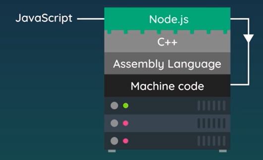
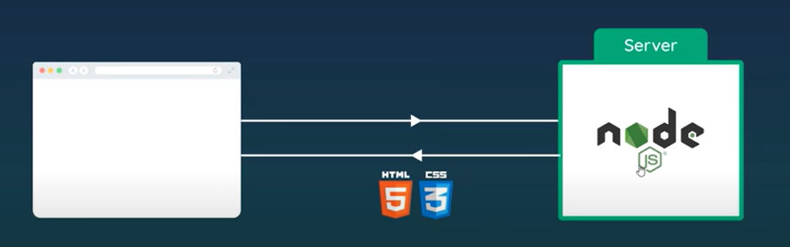

# Node.js

## Intro

| Front-end(browser)                                   | Back-end (server)                    |
| ---------------------------------------------------- | ------------------------------------ |
| **JS**: Add interactivity to pages(click events etc) | **NODE JS**: Run JS on a server side |

## Computers & Code

Computers only understand machine code<br>
So assembly language is used to make it easier to code in<br>
And ON TOP of that we have languages like C++

So C++ is compiled to machine code so the computer can understand it<br>
JS is abstracted even further away from machine code than C++<br>


### How does JS work in browsers?

Running in browsers is an engine called V8 engine(written in C++)<br>
It compiles JS to machine code in the browser so JS cannot run outside the <br>browser without the engine

### Enter NodeJS

Another program in C++ which *wraps* V8 engine<br>
Since NodeJS is written in C++ and compile to machine code<br>

So in essence we can run JS directly on a computer using NodeJS

### Node is more than a wrapper to V8

It can:

- Read & Write files on a computer
- Connect to a database
- Act as  a server for content

Since JS is running outside browser, so we cant use DOM(Document Object Model)<br>
BUT we dont need that since we're now running it on a server, ie the backend

NodeJS comes above this hierarchy 


## Role of Node.js

Run JS on the server side and handle requests coming from a browser



### Why use Node.js?

- No extra language for server if yk JS
- Can share code bw front and back end
- Node.js has a massive community behind it
- Huge amount of third-party packages & tools to help


### Running files using node.js

If you have a `test.js` file:
```js
const name = "Mario";

console.log(name);
```

You can run it on terminal by:
```bash
$ node test
mario
```


<div class="page-break-after:always;"></div>

