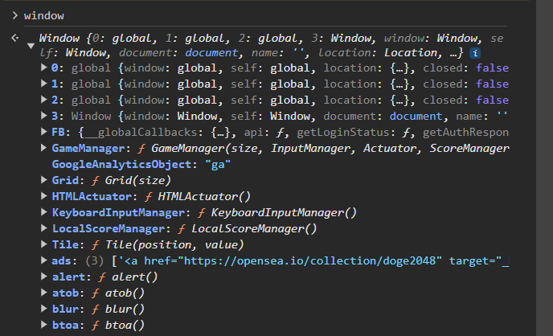

# Node.js Basics

Arrow functions + you can put ` character to have f-strings:
```js
const greet = (n) =>{
    console.log(`Hello, ${n}`);
}

greet("Mario");
greet("Luigi");
```

This gives

```bash
Mario
Luigi
```


## The Global Object

Just like on the browser, if you see the `window` class, it has certain methods:


Similarly nodejs has a `global` object:
```js
// The global object 
console.log(global);
```

which gives
```bash
$ node global
<ref *1> Object [global] {
  global: [Circular *1],
  clearImmediate: [Function: clearImmediate],
  setImmediate: [Function: setImmediate] {
    [Symbol(nodejs.util.promisify.custom)]: [Getter]
  },
  clearInterval: [Function: clearInterval],
  clearTimeout: [Function: clearTimeout],
  setInterval: [Function: setInterval],
  setTimeout: [Function: setTimeout] {
    [Symbol(nodejs.util.promisify.custom)]: [Getter]
  },
  queueMicrotask: [Function: queueMicrotask],
  structuredClone: [Getter/Setter],
  atob: [Getter/Setter],
  btoa: [Getter/Setter],
  performance: [Getter/Setter],
  fetch: [Function: fetch],
  crypto: [Getter]
}
```

Can use `global.setTimeOut()`:
```js
global.setTimeout(()=>{
    console.log('in the timeout')   
},3000)
```

this prints after doing a time-out of 3 seconds

Can omit `global` and it is implied:
```js
setTimeout(()=>{
    console.log('in the timeout')   
},3000)
```


Writing using interval:
```js
const interval = setInterval(()=>{
    console.log('in the interval');
},1000)

setTimeout(()=>{
    console.log('in the timeout');
    clearInterval(interval);
},3000)
```

This will print `in the interval` after 1 second each and print `in the timeout` at the third second, where the program terminates
```bash
$ node global
in the interval
in the interval
in the timeout
```


Doing:
```js
console.log(__dirname);
console.log(__filename);
```

gives:
```bash
$ node global
/home/asterbot/WebDevStuff/nodejs
/home/asterbot/WebDevStuff/nodejs/global.js
```

(the paths you expect)


Also 
```js
console.log(document.querySelector);
```

does not work, since `document` object is *not* in the global scope of node-js, but it is in the global scope of the window when we work on the front-end. <br>
Since nodejs works on the server-side, it is not required


## Modules & Require

Consider:

**people.js**:
```js
const people = ['A','B','C','D'];

console.log(people);
```

**modules.js**:
```js
const xyz = require('./people')

console.log(xyz);   
console.log(people);
```

Running `modules`:
```bash
$ node modules
[ 'A', 'B', 'C', 'D' ]
{}
/home/asterbot/WebDevStuff/nodejs/modules.js:4
console.log(people);
            ^

ReferenceError: people is not defined
    at Object.<anonymous> (/home/asterbot/WebDevStuff/nodejs/modules.js:4:13)
    at Module._compile (node:internal/modules/cjs/loader:1376:14)
    at Module._extensions..js (node:internal/modules/cjs/loader:1435:10)
    at Module.load (node:internal/modules/cjs/loader:1207:32)
    at Module._load (node:internal/modules/cjs/loader:1023:12)
    at Function.executeUserEntryPoint [as runMain] (node:internal/modules/run_main:135:12)
    at node:internal/main/run_main_module:28:49

Node.js v20.10.0
```

Notice `xyz` is an **empty object**<br>
Also `people` is not accessible in modules

This happens because `people.js` is not *exporting* anything

To do that:<br>
**people.js**
```js
const people = ['A','B','C','D'];

console.log(people);

module.exports = 'hello'; //this is what is returned to whoever requires this file
```

Now the output of `console.log(xyz)` is `hello`<br>
So we can do:
```js
//...
module.exports = people;
```

So running `modules.js`:
```js
const xyz = require('./people')

console.log(xyz);   
```
And we get:
```bash
$ node modules
[ 'A', 'B', 'C', 'D' ]
[ 'A', 'B', 'C', 'D' ]
```

### Returning multiple objects

**people.js**
```js
const people = ['A','B','C','D'];
const ages = [10,20,30,40];


module.exports = {
    people:people,
    ages:ages
};
```
An acceptable shorthand is:
```js
//...
module.exports={
  people,ages
};
```
And `modules.js` being the same

You get the output:
```bash
$ node modules
{ people: [ 'A', 'B', 'C', 'D' ], ages: [ 10, 20, 30, 40 ] }
```

Since we returned an object, we can just access the fields:<br>
**modules.js**
```js
const xyz = require('./people')

console.log("People:",xyz.people, "Ages:",xyz.ages);   
```
```bash
$ node modules
People: [ 'A', 'B', 'C', 'D' ] Ages: [ 10, 20, 30, 40 ]
```

Can also use *destructuring*:<br>

**modules.js**
```js
const { people, ages } = require('./people')

console.log("People:",people," Ages:" ,ages);   
```

```bash
$ node modules
People: [ 'A', 'B', 'C', 'D' ]  Ages: [ 10, 20, 30, 40 ]
```

Can also access `os` object by requiring it:

```js
const os = require('os');

console.log(os.platform(),'\n', os.homedir());
```
And you get:
```bash
linux 
 /home/asterbot
```

## File System in Node
Reading/Writing/Creating/Deleting files cannot be done on a computer system without Node!

First we need to import the module for files

```js
const fs = require('fs');
```

### Reading files
To read a file, call `fs.readFile` which takes in 2 arguments: the name of the file and a *callback function*

The callback function is called after the file is attempted to be read and requires 2 arguments: `err` and `data`:
- `err`: The error thrown (if any)
- `data`: The data found

So we can do:
```js

```