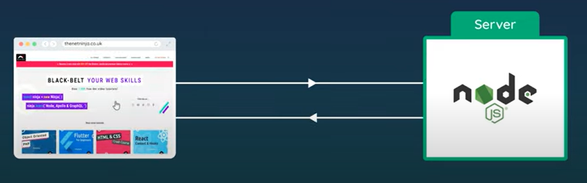
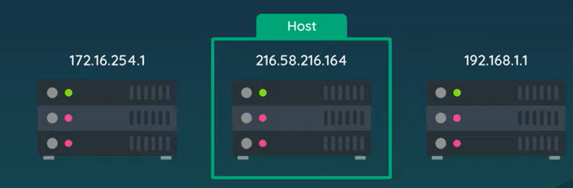
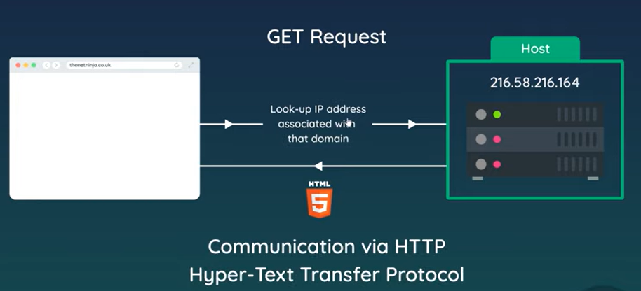
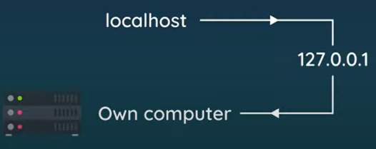

# Clients & Servers

End goal: Website with server-side managed by Node <br>
So it should listen for incoming requests by the browser



Communication between browser and server?

- how does browser send to correct server?


## IP Addresses & Domains

### IP Addresses
All computers connected to the internet have unique IP addresses to identify themselves in the network

**Hosts:** Special computers which host websites- when you host a website, it will be hosted via a host computer

To connect to a server on a host computer, we need its IP Address(and type the IP address on browser and connect)




### Domain Names
Mask the IP Addresses since they are difficult to remember



When you type a URL, the look-up for IP happens and it uses it to connect to the server on the host computer

The server looks at **GET request** and responds with a HTML page

This communication via HTTP(hyper-text transfer protocol)


## Creating a server

Creating a server and listen for requests using node<br>
We will create the server which will listen to the browser for requests

First include the HTTP protocol and create a new server:
```js
const http = require('http');
```

Use `http.createServer()` to make the server<br>
It is useful to store the server if you're using web-sockets<br>
It takes in one argument - a callback function which runs every time we get a request on the server

The callback function gives 2 things: a *request object* and a *response object*
- **request object:** gives full information about the request(like the URL being requested,request type(GET/POST) and more)
- **response object:** used to send response to the user

We can listen using `listen` method and give it a port

```js
const http = require('http');

const server = http.createServer((req,res)=>{
    console.log("Request made");
});

server.listen(3000, 'localhost', ()=>{
    console.log("Listening for requests on port 3000");
});
```
The callback function in `listen` is called whenever we are listening to that port


## Localhost & Port

**Localhost:** like a domain-name on the web<br>
This takes us to a specific IP address called the *loop-back IP address* [which is `127.0.0.1`] and that points to your own computer




So using `localhost` on a browser connects it back to our own computer- which acts as a host for the website


### Port number

Port numbers represents a channel/gateway/door into a computer that a certain software should communicate through

- 3000 is a common one for local web development

So we type `localhost:3000`


Back to our code, we are listening to `localhost:3000`
```js
const http = require('http');

const server = http.createServer((req,res)=>{
    console.log("Request made"); //(1)
});

server.listen(3000, 'localhost', ()=>{
    console.log("Listening for requests on port 3000");
});
```

Running the code, we will get a print of `Listening for requests on port 3000` and if you try to run `localhost:3000` on a browser you will see that `request made` will be printed, ie. we successfully reached (1) in the code

Although, `localhost:3000` won't load because we aren't doing anything


