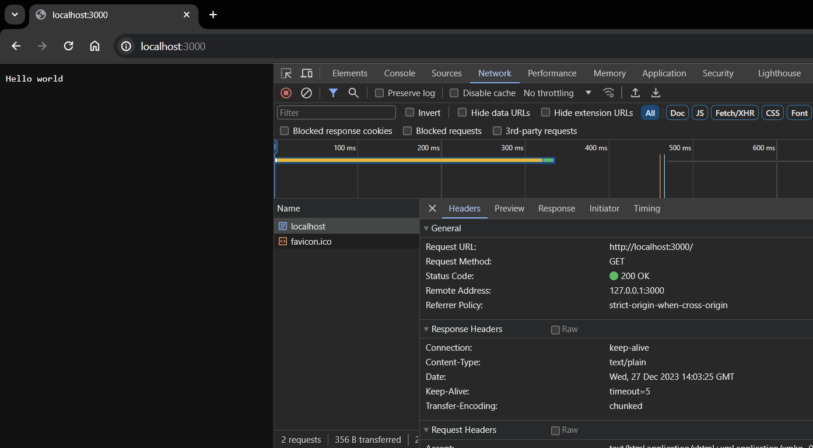
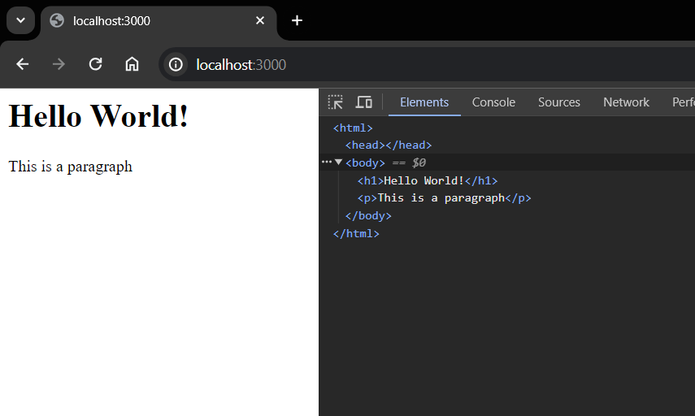
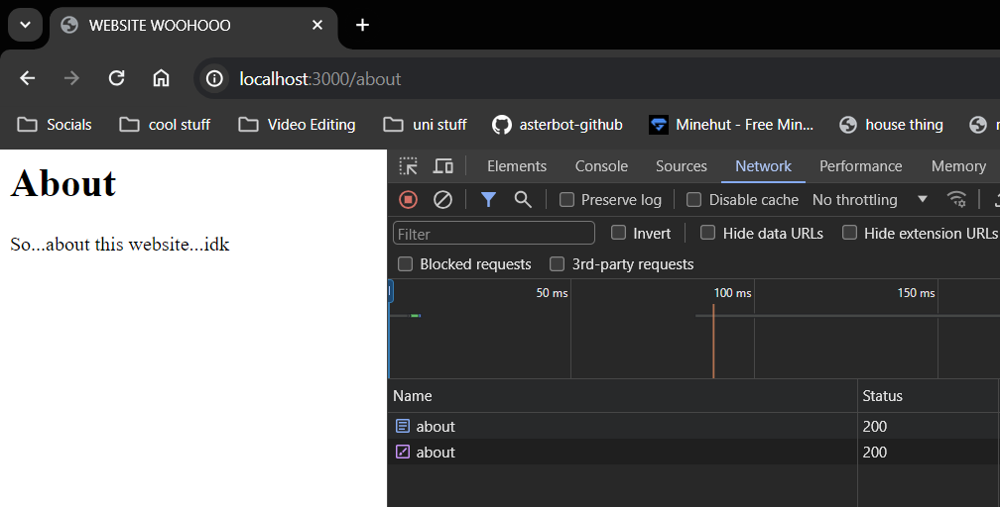
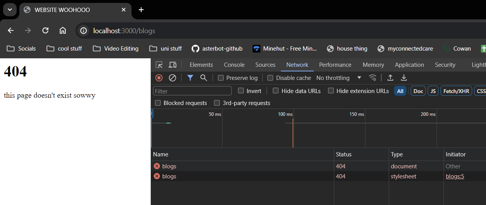

# Requests & Responses

Remember the code:
```js
const http = require('http');

//Creates the server and runs the callback when request is made
const server = http.createServer((req,res)=>{
    console.log("Request made");
});

// Listens for localhost:3000
server.listen(3000, 'localhost', ()=>{
    console.log("Listening for requests on port 3000");
}); 
```

## The request object

If we do 
```js
//...
const server = http.createServer((req,res)=>{
    console.log(req);
});
//...
```
To see the request object, we will see a really big object
```
Request made <ref *2> IncomingMessage {
  _readableState: ReadableState {
    highWaterMark: 16384,
    buffer: BufferList { head: null, tail: null, length: 0 },
    length: 0,
etc...
```

Let's access some fields of the object<br> 
Specifically the `url` field - gives the URL<br>
and the `method` field - whether it is a POST or GET method


```js
//...
const server = http.createServer((req,res)=>{
    console.log("URL:",req.url, " Method:",req.method);
});
//...
```
This gives:
```
Listening for requests on port 3000
URL: /  Method: GET
```
Notice the URL does not give `localhost:3000`, it is the URL *after* that point (which is just `/` rn)

If we try to access `localhost:3000/about` on the browser, we will get the following output:
```
Listening for requests on port 3000
URL: /about  Method: GET
```
So `/about` is the URL after `localhost:3000`


## The response object
Right now, the browser isn't loading anything since we aren't *responding* with anything yet

We need to formulate some kind of response

Formulate the **response headers** - gives browser information on what kind of information we plan to give it(data- html, json, text,etc)

To send a Content-type response of text, we do:
```js
//...
const server = http.createServer((req,res)=>{
    console.log("URL:",req.url, " Method:",req.method);

    // set header content type
    res.setHeader('Content-Type', 'text/plain');

    res.write("Hello world");
    
    // I am done with the response, send it
    res.end();
});
//...
```

Now the response "Hello World" is visible on `localhost:3000` as plain text:



Notice the Response headers section upon inspecting, you see the `Content-Type` is `text/plain` and others are set automatically

### Sending HTML

```js
const server = http.createServer((req,res)=>{
    console.log("URL:",req.url, " Method:",req.method);

    // set header content type
    res.setHeader('Content-Type', 'text/html');

    res.write("<h1>Hello World!</h1>");
    res.write("<p>This is a paragraph</p>")
    
    // I am done with the response, send it
    res.end();
});
```

And you get:

 

Notice the HTML is coming after you inspect it too<br>
It automatically added `<html>`, `<head>` and `<body>` tags

We can change it if we want:
```js
//...
const server = http.createServer((req,res)=>{
    console.log("URL:",req.url, " Method:",req.method);

    // set header content type
    res.setHeader('Content-Type', 'text/html');


    res.write('<head> <link rel="stylesheet" href="#"></head>')
    res.write("<h1>Hello World!</h1>");
    res.write("<p>This is a paragraph</p>")
    
    // I am done with the response, send it
    res.end();
});
//....
```
And it replaces the default one for us

## Returning HTML pages
Returning line-by-line HTML is clunky<br>
Would prefer to return entire HTML file

Put the HTML file in a directory called `views` and create `index.html`:
```html
<html>
    <head>
        <meta charset="utf-8">
        <meta name="viewport" content="width=device-width, initial-scale=1.0">
        <title>WEBSITE WOOHOOO</title>
        <link rel="stylesheet" href="#">
    </head>
    <body>
       <h1>Hello World</h1>

       <p>This is a paragraph</p>
    </body>
</html>
```

We need to require the module `fs` for this to work since we are now dealing with a separate file<br>
All we do is read the file and send the data read to the browser via `res` object

```js
const http=require('http');
const fs = require('fs');

const server = http.createServer((req,res)=>{
    console.log("URL:",req.url, " Method:",req.method);

    // set header content type
    res.setHeader('Content-Type', 'text/html');
    
    // Read the HTML file
    fs.readFile('./views/index.html', (err,data)=>{
        if(err){
            console.log(err);
            res.end();
        }
        else{
            res.write(data); //(1)
            res.end();
        }
    })
    
});

server.listen(3000, 'localhost', ()=>{
    console.log("Listening for requests on port 3000");
}); 
```

Put `res.end()` in both cases to ensure that the response is ended either way

Also, we don't need to put `res.write(data)` if it's the only thing we're writing. We can equivalently change **(1)** to:
```js
else{
    res.end(data);
}
```


## Basic Routing
Currently our web page looks the same despite the URL just as long as it begins with `localhost:3000`, for example it accepts `localhost:3000/about`, `localhost:3000/blogs` etc

We need to make it possible to route and switch between HTML pages depending on the URL

In the view directory create two new HTML pages:

**about.html**: (this should be sent for `localhost:3000/about`)
```html
<html>
    <head>
        <meta charset="utf-8">
        <meta name="viewport" content="width=device-width, initial-scale=1.0">
        <title>WEBSITE WOOHOOO</title>
        <link rel="stylesheet" href="#">
    </head>
    <body>
       <h1>About</h1>

       <p>So...about this website...idk</p>
    </body>
</html>
```

**404.html**:(this is to be loaded for any invalid routes)
```html
<html>
    <head>
        <meta charset="utf-8">
        <meta name="viewport" content="width=device-width, initial-scale=1.0">
        <title>WEBSITE WOOHOOO</title>
        <link rel="stylesheet" href="#">
    </head>
    <body>
       <h1>404</h1>

       <p>this page doesn't exist sowwy</p>
    </body>
</html>
```

We can access the path using `req.url`<br>
To generate the path of file *we* need to access we must do some case-work, and replace the path variable accordingly
```js
//...
let path = './views/';
switch(req.url){
    case '/':       // home page
        path+='index.html'
        break;
    case '/about':  // about page
        path+='about.html'
        break;
    default:        // none of them; ie. error
        path+='404.html'
        break;
}

// Read the HTML file
fs.readFile(path, (err,data)=>{
    if(err){
        console.log(err);
        res.end();
    }
    else{
        res.end(data);
    }
})
//...
```

## Status Codes

Status codes are the types of responses being sent to the browser about how successful the response was

Common response codes:
- 200: OK
- 301: Resource moved
- 404: Not found
- 500: Internal Server Error

There are loads more, but there are one of these ranges:
- 100 range: Informational responses
- 200 range: Success codes
- 300 range: Codes for redirects
- 400 range: User/client error codes
- 500 range: Server error codes


Let's add status codes to our responses, when we are checking the URL:

```js
//...
let path = './views/';
switch(req.url){
    case '/':
        path+='index.html'
        res.statusCode=200;
        break;
    case '/about':
        path+='about.html'
        res.statusCode=200;
        break;
    default:
        path+='404.html'
        res.statusCode=404;
        break;
}
//...

```

These status codes are received by the browser and can be checked via inspect element

| Success(200) | Failure(404) |
| ---- | ---- |
| |  |


## Redirects

Suppose `localhost:3000/about` was previously called `localhost:3000/about-me` and we need to redirect all traffic from `../about-me` to `../about`

How do we do it?<br>
We will firstly set the status code to 301 (resource moved) and set a new response header for redirection:

```js
let path = './views/';
    switch(req.url){
        //...
        case '/about':
            path+='about.html'
            res.statusCode=200;
            break;
        case '/about-me':
            res.statusCode=301;
            res.setHeader('Location','/about'); //redirect to /about
            res.end();
            break;
        //...
    }
```

Writing so many switch cases for very large web applications can be tedious to maintain - a third party app express helps with doing this in a more elegant way.
