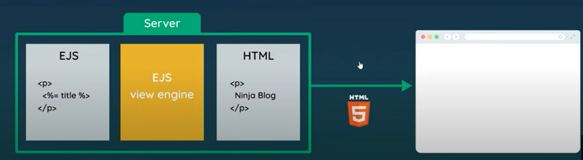

# View Engines

Currently all the content on the website is static (ie. predefined and doesn't change)

To inject dynamic data(like from databases) or user-data

This is where view engines/template engines come in

View engines let us write HTML like:
```html
<html>
    <head>
        <meta charset="utf-8">
        <meta name="viewport" content="width=device-width, initial-scale=1.0">
        <title>WEBSITE WOOHOOO</title>
        <link rel="stylesheet" href="#">
    </head>
    <body>
        <nav>
            <a href="/">Home</a>
            <a href="/about">About</a>
        </nav>

       <h1>Hello World</h1>
       <p>This is a paragraph</p>

    </body>
</html>
```
But allows to put logic like variables, loops etc.

## EJS(Embedded JavaScript templates)
Find on npm website

To set it up in the js, do:
```js
const express = require('express');

// express app
const app = express();

// register view engine
app.set('view engine', 'ejs');

//...
```
Now it knows the view engine we want is ejs

Make `index.ejs` file:
```html
<html>
    <head>
        <meta charset="utf-8">
        <meta name="viewport" content="width=device-width, initial-scale=1.0">
        <title>WEBSITE WOOHOOO</title>
        <link rel="stylesheet" href="#">
    </head>
    <body>
        <nav>
            <a href="/">Home</a>
            <a href="/about">About</a>
        </nav>

       <h1>Hello World</h1>
       <p>This is a paragraph</p>

    </body>
</html>
```

Currently it is the same as vanilla HTML

To render the view, we do:
```js
const express = require('express');

// express app
const app = express();

// register view engine
app.set('view engine', 'ejs');

// listen for requests
app.listen(3000);

app.get('/',(req,res)=>{
    res.render('index');
});

app.get('/about',(req,res)=>{
    res.render('about')
});


// Redirects
app.get('/about-us',(req,res)=>{
    res.redirect('/about');
});

// 404
app.use((req,res)=>{
    res.render('404')
});
```

Now it renders correctly 

The idea is that the `render` function looks in the views folder automatically and renders the correct file accordingly

## Passing data into views

Adding dynamic content in ejs files

```html
<!--- ... --->
<body>
    <% const name = 'mario' %>

    <nav>
        <a href="/">Home</a>
        <a href="/about">About</a>
    </nav>

    <!--- Must put "=" to render -->
    <%=name %>

    <h1>Hello World</h1>
    <p>This is a paragraph</p>
</body>
```
And now the name variable renders as expected

How to get data using `app.js`?

Say we want to make the title of the webpage dynamic<br>
Just need to do:
```js
//...
app.get('/',(req,res)=>{
    res.render('index',{ title: 'Home' });
});
```
We just need to pass an object and store in the fields what we want

Then in `index.ejs` we can do:
```html
<html>
    <head>
        <title>WEBSITE WOOHOOO | <%= title %></title>
    </head>
```
Don't need to *reference* any object, just need to reference the field directly

Can do the same for other pages

What if we want to pass an array of objects into the HTML pages to render?
```js
app.get('/',(req,res)=>{
    const blogs = [
        {title: 'Yoshi finds eggs', snippet: 'Lorem ipsum dolor sit amet, consectetur adipiscing elit'},
        {title: 'Mario finds stars', snippet:'Lorem ipsum dolor sit amet, consectetur adipiscing elit'},
        {title: 'How to defeat bowser', snippet:'Lorem ipsum dolor sit amet, consectetur adipiscing elit'},
        
    ];
    res.render('index',{ title: 'Home', blogs: blogs });
});
```

Let's try rendering this in the ejs file

```html
<div class="blog-content">
        <h2>All blogs</h2>

        <% if(blogs.length > 0){ %>
            <% blogs.forEach((blog)=>{ %>
                <h3 class="title"> <%=blog.title %> </h3>
                <p class="snippet"> <%=blog.snippet %> </p>    
            <% }) %>
        <%} else{ %>
            <h2>there are no blogs :/</h2>
        <% } %>

       </div>
```
This renders the blogs and you can use the `forEach` function to run it for all of them

EJS templates are processed through the EJS engine on the server. This happens via **Server-side rendering**


Steps:
- View files live on the server which is passed to the EJS view engine. 
- The engine looks for dynamic content(varaiables, loops etc) and figures out the resulting HTML code and spits out the valid HTML page based on the template
- And that HTML page is give to the browser

## Partials

Currently our header and navbar is common to all views:
```html

<head>
    <meta charset="utf-8">
    <meta name="viewport" content="width=device-width, initial-scale=1.0">
    <title>WEBSITE WOOHOOO | <%= title %></title>
    <link rel="stylesheet" href="#">
</head>

<nav>
    <a href="/">Home</a>
    <a href="/about">About</a>
</nav>
```
To update this in each website as it is scaled up, it might be clunky to change *all*<br>
Instead use *partials* - and import into the views as needed

Can be done via express

Create a partials folder in view. We will make 3 partials - one for navbar and one for header(and one for footer too)

Create these in the partials folder:

**nav.ejs**
```html
<nav>
    <a href="/">Home</a>
    <a href="/about">About</a>
</nav>
```
**head.ejs**:
```html
<head>
    <meta charset="utf-8">
    <meta name="viewport" content="width=device-width, initial-scale=1.0">
    <title>WEBSITE WOOHOOO | <%= title %></title>
    <link rel="stylesheet" href="#">
</head>
```
**footer.ejs:**
```html
<footer>
    Copyright &copy; Cool website
</footer>
```

Now in the places where you want to include these, this is the syntax:
```html
<html>
    <%- include('./partials/head.ejs') %>
    <body>

        <%- include('./partials/nav.ejs') %>

        <!-- (rest of the stuff) -->

        <%- include('./partials/footer.ejs') %>

    </body>
</html>
```
Be careful- here we do `<%- ... %>` and *not* `<%= ... %>` since `=` escapes special characters and it returns the string (and not raw HTML)
<br>So use `-` for includes


## Adding CSS
For now we can just add it to `head.ejs`:
```html
<head>
    <meta charset="utf-8">
    <meta name="viewport" content="width=device-width, initial-scale=1.0">
    <title>WEBSITE WOOHOOO | <%= title %></title>
    <link rel="stylesheet" href="#">
</head>
<style>
    /* (CSS goes here) */
</style>    
```

And it will render correctly. To get a separate stylesheet, need to understand middleware