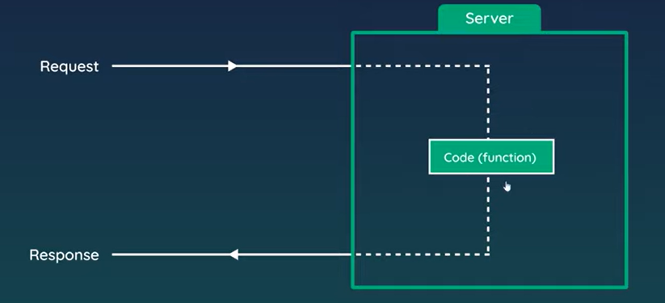
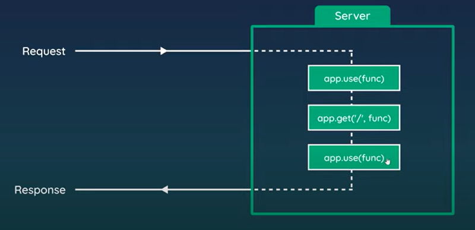
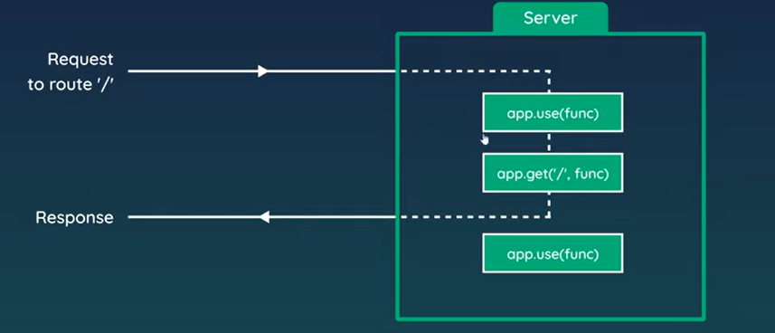

# Middleware

- Code which runs (on the server) between getting a request and sending a response


Any code that runs between receiving a request and sending a response is a middleware

Usually `app.use(func)` is used to run middleware code (like we did to handle 404 cases)

Usually you have multiple middlewares which would run on the server before a response is sent


This runs each of them top-to-bottom in the server

For example, if we receive the route `/` it would go something like this:



## Middleware examples
- Logger middleware to log details of every request
- Authentication check middleware for projected routes
- Middleware to parse JSON data from request
- Return 404 pages


## Creating middleware in code

Currently we already have *some* middleware:
```js
const express = require('express');

// express app
const app = express();

// register view engine
app.set('view engine', 'ejs');

// listen for requests
app.listen(3000);

app.get('/',(req,res)=>{
    const blogs = [
        {title: 'Yoshi finds eggs', snippet: 'Lorem ipsum dolor sit amet, consectetur adipiscing elit'},
        {title: 'Mario finds stars', snippet:'Lorem ipsum dolor sit amet, consectetur adipiscing elit'},
        {title: 'How to defeat bowser', snippet:'Lorem ipsum dolor sit amet, consectetur adipiscing elit'},
        
    ];
    res.render('index',{ title: 'lolollo', blogs: blogs });
});

app.get('/about',(req,res)=>{
    res.render('about',{ title: 'About' })
});


// Redirects
app.get('/about-us',(req,res)=>{
    res.redirect('/about');
});

// 404
app.use((req,res)=>{
    res.render('404', { title: '404' })
});
```
First we try to match different URL routes, and if none of them work the middleware for 404 pages fires

Let's try to see what `app.use` receives as a request by putting this on the top:

```js
app.use((req,res)=>{
    console.log('New request made');
    console.log('Host:', req.hostname);
    console.log('Path:', req.path);
    console.log('Method:',req.method);
});
```
And we get the output:
```
New request made
Host: localhost
Path: /
Method: GET
```
Although the browser is hanging, since after express runs this code, it doesn't know how to move on to other middleware (which are the remaining `.get()` statements)

## Using next()

This is a parameter which you can take when writing the callback function for the middleware. All you need to do is invoke it:
```js
app.use((req,res,next)=>{
    console.log('New request made');
    console.log('Host:', req.hostname);
    console.log('Path:', req.path);
    console.log('Method:',req.method);
    next(); //invoke it
});
```

Let's test this by adding multiple middlewares

```js
const express = require('express');

// express app
const app = express();

// register view engine
app.set('view engine', 'ejs');

// listen for requests
app.listen(3000);

app.use((req,res,next)=>{
    console.log('New request made');
    console.log('Host:', req.hostname);
    console.log('Path:', req.path);
    console.log('Method:',req.method);
    next();
});

app.use((req,res,next)=>{
    console.log('In the next request');
    next();
});


app.get('/',(req,res)=>{
    const blogs = [
        {title: 'Yoshi finds eggs', snippet: 'Lorem ipsum dolor sit amet, consectetur adipiscing elit'},
        {title: 'Mario finds stars', snippet:'Lorem ipsum dolor sit amet, consectetur adipiscing elit'},
        {title: 'How to defeat bowser', snippet:'Lorem ipsum dolor sit amet, consectetur adipiscing elit'},
        
    ];
    res.render('index',{ title: 'lolollo', blogs: blogs });
});

app.get('/about',(req,res)=>{
    res.render('about',{ title: 'About' })
});


// Redirects
app.get('/about-us',(req,res)=>{
    res.redirect('/about');
});

// 404
app.use((req,res)=>{
    res.render('404', { title: '404' })
});
```

And we get the output:
```
New request made
Host: localhost
Path: /
Method: GET
In the next request
```

So clearly, it got to the next middleware


Suppose we put the second middleware *after* the home page render:
```js
//...
app.use((req,res,next)=>{
    console.log('New request made');
    console.log('Host:', req.hostname);
    console.log('Path:', req.path);
    console.log('Method:',req.method);
    next();
});

app.get('/',(req,res)=>{
    const blogs = [
        {title: 'Yoshi finds eggs', snippet: 'Lorem ipsum dolor sit amet, consectetur adipiscing elit'},
        {title: 'Mario finds stars', snippet:'Lorem ipsum dolor sit amet, consectetur adipiscing elit'},
        {title: 'How to defeat bowser', snippet:'Lorem ipsum dolor sit amet, consectetur adipiscing elit'},
        
    ];
    res.render('index',{ title: 'lolollo', blogs: blogs });  //(1)
});

app.use((req,res,next)=>{
    console.log('In the next request');
    next();
});

//...
```

In this case the second middleware will NOT fire, since we send a response at (1), so it never gets ahead


## 3rd party middleware