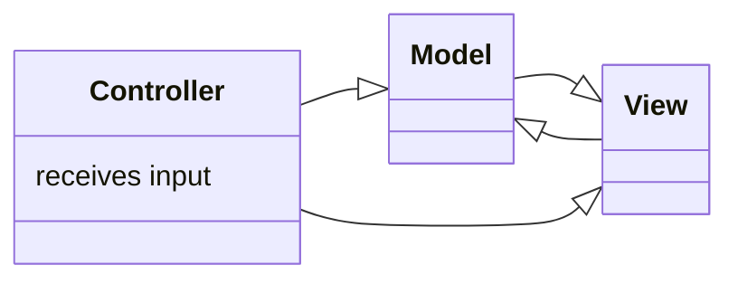

# Express Routers and MVC
Express router - used to split the backend into different files and manage them <br>
Increases modularity, easier to maintain

For example, we have many routes which together make the blogs route
```js
// Blog routes

app.get('/blogs', (req,res)=>{
    Blog.find().sort(({ createdAt: -1 }))
        .then((result)=>{
            res.render('index', {title: 'All blogs', blogs: result})
        })
        .catch((err)=>{
            console.log(err);
        })
})

app.post('/blogs', (req,res)=>{
    const blog = new Blog(req.body);
    blog.save()
        .then((result)=>{
            res.redirect('blogs');
        })
        .catch((err)=>{
            console.log(err);
        })
});


app.get('/blogs/create', (req,res)=>{
    res.render('create', {title: 'Create a New Blog'})
}); 

app.get('/blogs/:id', (req,res)=>{
    const id = req.params.id;
    Blog.findById(id)
        .then((result)=>{
            res.render('details', {blog: result, title: 'Blog details'})
        })
        .catch((err)=>{
            console.log(err);
        })
});

app.delete('/blogs/:id', (req,res)=>{
    const id = req.params.id;
    Blog.findByIdAndDelete(id)
            .then((result)=>{
                res.json({ redirect: '/blogs' })
            })
            .catch((err)=>{
                console.log(err);
            })
});
```

We can split them into one file since they all are concerned with one type of resource and they belong together

A router is like a mini version of this `app` object. Take all this code and put it in `routes/blogRoutes.js`:
```js
const express = require('express');
const Blog = require('../models/blog')

// New router object
const router = express.Router();


router.get('/blogs', (req,res)=>{
    Blog.find().sort(({ createdAt: -1 }))
        .then((result)=>{
            res.render('index', {title: 'All blogs', blogs: result})
        })
        .catch((err)=>{
            console.log(err);
        })
})

router.post('/blogs', (req,res)=>{
    const blog = new Blog(req.body);
    blog.save()
        .then((result)=>{
            res.redirect('blogs');
        })
        .catch((err)=>{
            console.log(err);
        })
});


router.get('/blogs/create', (req,res)=>{
    res.render('create', {title: 'Create a New Blog'})
}); 

router.get('/blogs/:id', (req,res)=>{
    const id = req.params.id;
    Blog.findById(id)
        .then((result)=>{
            res.render('details', {blog: result, title: 'Blog details'})
        })
        .catch((err)=>{
            console.log(err);
        })
});

router.delete('/blogs/:id', (req,res)=>{
    const id = req.params.id;
    Blog.findByIdAndDelete(id)
            .then((result)=>{
                res.json({ redirect: '/blogs' })
            })
            .catch((err)=>{
                console.log(err);
            })
});

module.exports = router;    
```

**app.js**:
```js
// other require statements
const blogRoute = require('./routes/blogRoutes');

//...

// Blog routes
app.use(blogRoute);

//...
```

We could also scope it to a specific URL

```js
app.use('/blogs',blogRoutes)
```
This means it will only check `blogRoutes` if the URL has `/blogs`

But currently this hangs the website `localhost:3000/blogs`<br>
BUT it works with `localhost:3000/blogs/blogs` that works :o

So the problem is in `blogRoutes.js` just change the URL it's checking for and remove the initial `blogs` from it

For example:
```js
router.get('/', (req,res)=>{
    Blog.find().sort(({ createdAt: -1 }))
        .then((result)=>{
            res.render('index', {title: 'All blogs', blogs: result})
        })
        .catch((err)=>{
            console.log(err);
        })
})
```
and the same for the rest

## MVC Basics

- Stands for **M**odel **V**iew **C**ontroller
- Method of structuring code and files
- Keeps code more modular, reusable and easier to read



We have already seen models and views
- **Views:** HTML templates
- **Models:** Use to describe data schemas and structure, use to interact with database

Now we must implement controllers
- they form the link between models and views
- We have done that with our route handlers
  - Can put these in a separate controller file which we can reference


## Controllers
Create a new folder for the `Controllers` and put `blogController.js` in it

We will implement the following functions:
- `blog_index`: Get all blogs and inject into index view
- `blog_details`: Get a single blog(at `blogs/:id` right now)
- `blog_create_get`: Send back the actual form for creating a new blog
- `blog_create_post`: Add a new blog 
- `blog_delete`: Delete the blog

The implementations already exist in `blogRoutes.js`, we just will abstract it differently

Now `blogController.js`:
```js
const Blog = require('../models/blog')

const blog_index = (req,res)=>{
    Blog.find().sort(({ createdAt: -1 }))
        .then((result)=>{
            res.render('index', {title: 'All blogs', blogs: result})
        })
        .catch((err)=>{
            console.log(err);
        })
};

const blog_details = (req,res)=>{
    const id = req.params.id;
    Blog.findById(id)
        .then((result)=>{
            res.render('details', {blog: result, title: 'Blog details'})
        })
        .catch((err)=>{
            console.log(err);
        })
};

const blog_create_get = (req,res)=>{
    res.render('create', {title: 'Create a New Blog'})
};

const blog_create_post = (req,res)=>{
    const blog = new Blog(req.body);
    blog.save()
        .then((result)=>{
            res.redirect('blogs');
        })
        .catch((err)=>{
            console.log(err);
        })
}

const blog_delete = (req,res)=>{
    const id = req.params.id;
    Blog.findByIdAndDelete(id)
            .then((result)=>{
                res.json({ redirect: '/blogs' })
            })
            .catch((err)=>{
                console.log(err);
            })
}

module.exports = {
    blog_index,
    blog_details,
    blog_create_get,
    blog_create_post,
    blog_delete
}
```

**blogRoutes.js**:
```js
const express = require('express');
const blogController = require('../controllers/blogController');

// New router object
const router = express.Router();

router.get('/', blogController.blog_index);
router.post('/', blogController.blog_create_post);
router.get('/create', blogController.blog_create_get); 
router.get('/:id', blogController.blog_details);
router.delete('/:id', blogController.blog_delete);

module.exports = router;    
```

This is more modular, easier to update and use in the future

We can also re-organize our views by putting all blog related files into a new directory called blogs

and change all the paths to `blogs/` in the controller, since it looks in Views folder by default

## One final thing to wrap up
When we go to `localhost:3000/blogs/(id_number)` but the `id_number` is invalid, the webpage hangs.

This can be fixed in the blog controller by instead of logging the errror in the console, we just display the 404 page
```js
const blog_details = (req,res)=>{
    const id = req.params.id;
    Blog.findById(id)
        .then((result)=>{
            res.render('blogs/details', {blog: result, title: 'Blog details'})
        })
        .catch((err)=>{
            console.log(err);
        })
};
```